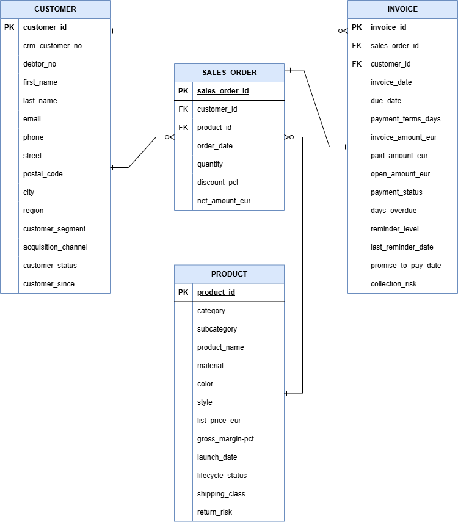
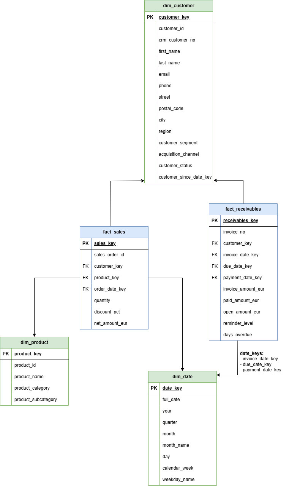
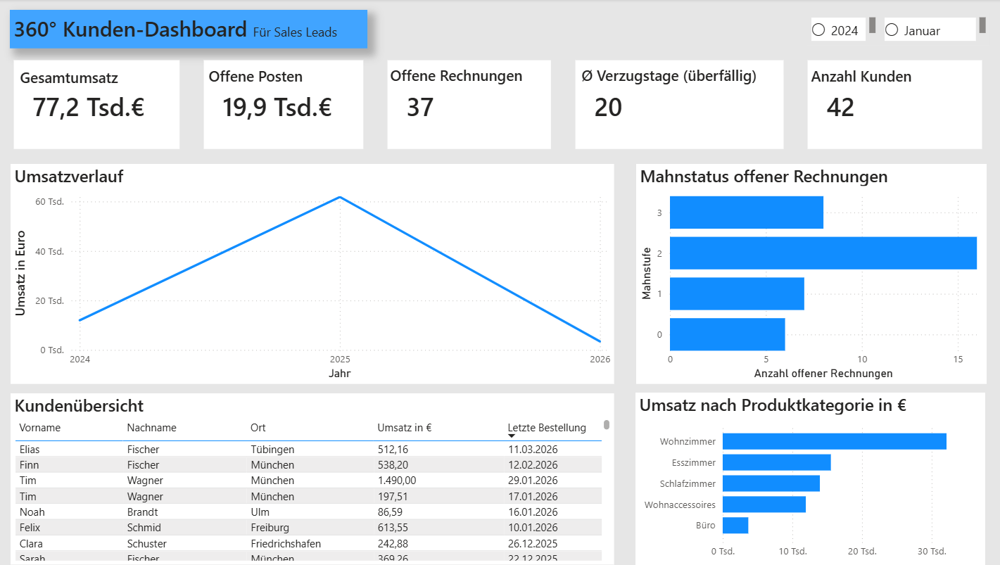
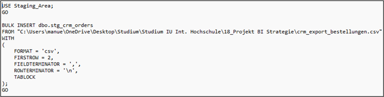
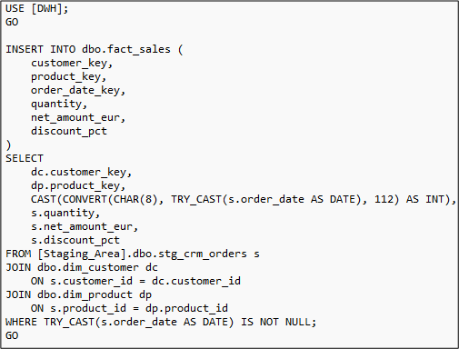
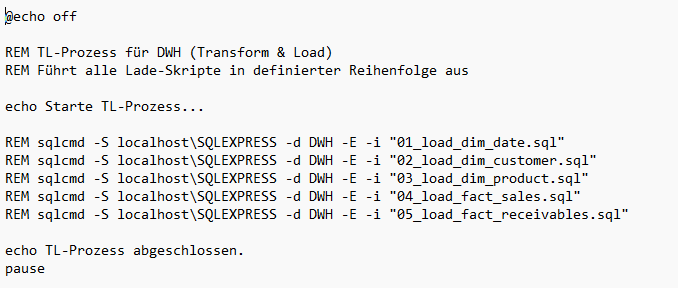

# BI Data Warehouse & Power BI Projekt
Business-Intelligence-Projekt mit SQL Server, Data Warehouse nach Kimball und Power-BI-Dashboard.

# Projektübersicht
Im Rahmen meines Studiums im Bereich Business Intelligence entwickelte ich eigenständig eine vollständige Business-Intelligence-Lösung für das Kundenbeziehungsmanagement eines Online-Möbelhändlers.

Ziel des Projekts war die Integration verschiedener operativer Datenquellen in ein zentrales Data Warehouse, um eine interaktive 360°-Sicht auf Kundenbeziehungen, Umsätze, offene Posten und Mahnstatus zu ermöglichen.

Die Umsetzung erfolgte auf Basis eines dimensionalen Datenmodells nach Kimball und umfasste die Entwicklung einer vollständigen BI-Architektur – von der Staging Area über den ETL-/Transformationsprozess bis hin zum interaktiven Power-BI-Dashboard.

# Architektur
CSV-Datenquellen
→ Staging Area
→ ETL-/Transformationsprozess
→ Data Warehouse (Star Schema nach Kimball)
→ Power BI Dashboard

# Technologien
- Microsoft SQL Server Express 2022
- SQL Server Management Studio (SSMS)
- SQL
- Power BI Desktop
- Data Warehousing
- Star Schema
- Dimensionale Datenmodellierung
- ETL-/TL-Prozesse
- Batch-Automatisierung (.bat)
- draw.io (Grafische Modellierung)

# Inhalt des Projekts

Staging Area
- Integration der Rohdaten aus verschiedenen Quellsystemen
- CSV-Import mittels BULK INSERT
- Separate Staging-Datenbank

Data Warehouse
- Entwicklung eines Star Schemas nach Kimball
- Faktentabellen:
 -- fact_sales
 -- fact_receivables
- Dimensionstabellen:
 -- dim_customer
 -- dim_product
 -- dim_date

ETL-/Transformationsprozess
- Transformation und Überführung der Daten in das Data Warehouse
- Aufbau von Schlüsselbeziehungen
- Vereinheitlichung von Datumsinformationen
- Simulierte Automatisierung über Batch-Datei und Windows-Aufgabenplanung

Power BI Dashboard
- Interaktive KPI-Analyse
- Drill-Down- und Roll-Up-Funktionen
- Umsatzanalysen
- Analyse offener Posten und Mahnstatus
- 360°-Kundensicht für Sales Leads

# Projektziel
Das Ziel des Projekts bestand darin, operative Daten aus CRM-, Finanz- und Produktdatenquellen in einer zentralen BI-Lösung zusammenzuführen und datenbasierte Entscheidungen im Vertrieb zu unterstützen.

# Hinweise
- Die verwendeten Daten basieren auf KI-generierten Testdaten.
- Das Projekt wurde als Proof of Concept im Rahmen des Studiums umgesetzt.
- Fokus: Architektur, Datenmodellierung und BI-Prozesse
- Aus Gründen der Übersichtlichkeit werden nur ausgewählte SQL-Statements (je Phase) als Screenshot dokumentiert.

---

# Ausgewählte Projektvisualisierungen

## Entity-Relationship-Diagramm

---

## Star Schema

---

## Power BI Dashboard

---

## Beispiel: Bulk-Insert in die Staging Area

---

## Beispiel: Transformations- und Ladeprozess

---

## Simulierter TL-Prozess mittels Batch-Datei

